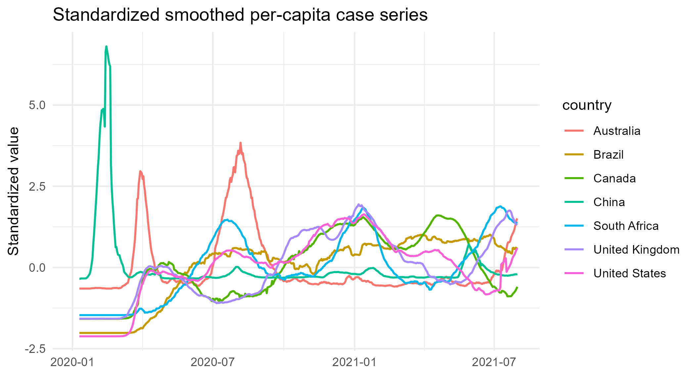
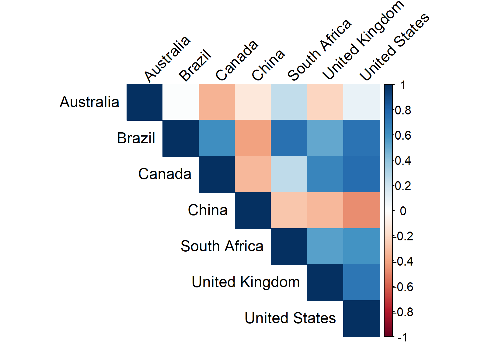
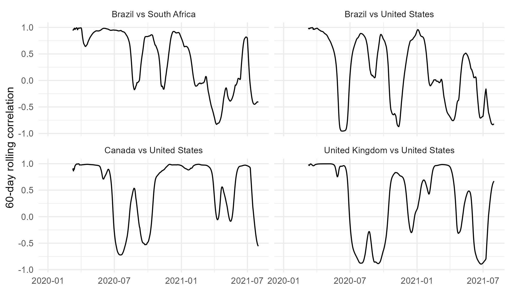
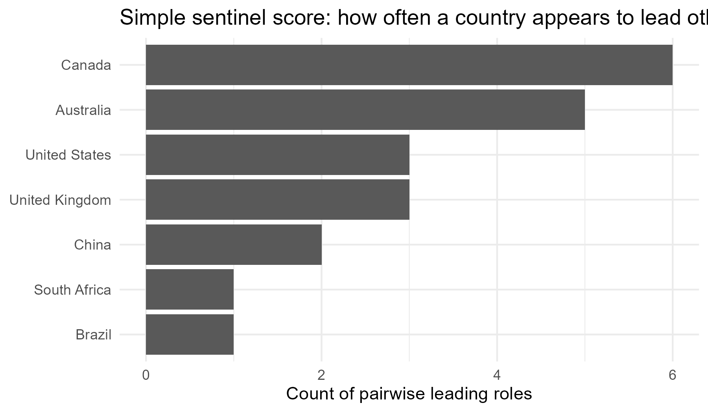
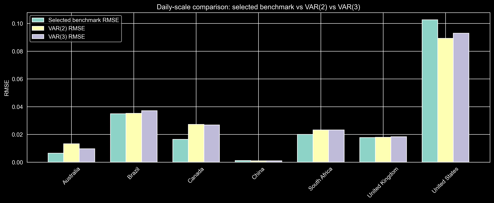
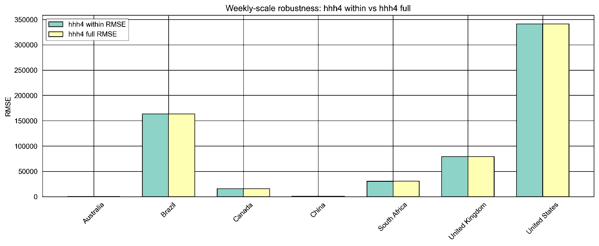

```{r setup}
# ── Packages ──────────────────────────────────────────────────────────────────
# Only lightweight table-formatting packages are loaded here.
# RQ1 figures (fig1–fig4) were pre-generated locally by running
#   Analysis/case_study_3_RQ1_analysis.qmd and are read from Results/Figures/.
# RQ2 figures (fig5–fig6) were pre-generated locally by running
#   Analysis/CS3_RQ2_analysis.ipynb and are read from Results/Figures/.
# All figures are included via include_graphics() — no heavy computation here.
# RQ2 derived scalars are read from committed CSV files in Analysis/.
library(dplyr)
library(readr)
library(tibble)
library(knitr)
library(kableExtra)
library(scales)

# ── Load committed RQ2 results (for inline scalars only) ─────────────────────
comparison_df   <- read_csv(
  "Analysis/comparison_with_hhh4.csv", show_col_types = FALSE)

# ── Derived scalars used inline ───────────────────────────────────────────────
us_rmse_gain_pct <- comparison_df |>
  filter(country == "United States") |>
  mutate(pct = rmse_gain_var2 / benchmark_rmse * 100) |>
  pull(pct) |>
  round(1)
```

<!-- ============================================================ -->

<!-- CONTEXT SECTION  (for graders; not counted in page limit)   -->

<!-- ============================================================ -->

\newpage

# Context {.unnumbered}

*This section is provided for the graders and is not part of the executive narrative.*

We are a team of data scientists at an infectious-disease forecasting and decision-support organization that produces short-term outbreak forecasts for public-health agencies.
Our stakeholder is the Director of Forecasting and Decision Support, whose team is responsible for delivering short-horizon epidemic projections to public-health agencies and health-system planners.

The practical setting for this project is routine outbreak monitoring and short-term forecasting.
A recurring operational question is whether signals from one jurisdiction should be incorporated when forecasting outcomes in another.
In this case, we study whether cross-country COVID-19 case patterns contain information that can improve short-horizon forecasting performance, and whether more granular U.S. state-level signals provide additional value beyond national aggregates.

This problem is well suited to statistical analysis because visual co-movement alone is not enough to justify operational forecasting changes.
Any recommendation to incorporate external signals must be supported by evidence that the relationships are comparable, stable enough to be useful, and capable of improving forecasts relative to credible country-specific benchmark models.

<!-- ============================================================ -->

<!-- RESPONSE TO FEEDBACK  (mandatory; ≤ 1 page; not counted)    -->

<!-- ============================================================ -->

\newpage

# Response to Feedback {.unnumbered}

*This section describes how we addressed technical feedback received after the Progress Update.*

Our original proposal asked three questions: **(Q1)** whether multivariate models improve short-term forecasts relative to country-specific models, **(Q2)** what cross-country dependence and lead–lag structure exist across the seven countries, and **(Q3)** whether U.S. state-level data adds value beyond the national aggregate.

The Progress Update raised four main concerns: COVID-19 needed a stronger justification of relevance; the original forecasting question was too ambitious given uncertain synchronization across countries; the report risked becoming fragmented; and the motivation was too generic.

We responded by redesigning the project.
First, we dropped Q3 and reorganized the report into a two-stage analysis: identify cross-country dependence, then test whether that dependence improves forecasts beyond strong country-specific benchmarks.
This made the project more coherent and turned the original forecasting question into a more specific and testable claim.

Second, we reframed COVID-19 as a methodological test bed rather than the ultimate disease of interest.
The broader question—when external regional signals deserve operational weight in short-horizon forecasting—remains relevant for influenza, RSV, and future emerging pathogens, while COVID-19 provides an unusually rich multi-country surveillance dataset for studying it rigorously.

Third, we strengthened the modeling strategy.
In response to concerns that a standard VAR framework alone would be too limited for epidemic data with sharp peaks and wave-like dynamics, we added the endemic-epidemic HHH4 model in Q2 as a complementary framework.
This made the analysis less dependent on a single linear time-series model and better aligned the modeling approach with infectious-disease count data.

Finally, we sharpened the stakeholder framing around a concrete decision: whether international signals should be incorporated as early-warning inputs or treated cautiously as unreliable noise.
We also made clearer why the seven-country panel is still informative: it balances geographic diversity with practical comparability while remaining small enough for transparent dependence analysis.

Overall, the final report is narrower than the original proposal, but substantially stronger in coherence, methodological justification, and decision relevance.

<!-- ============================================================ -->

<!-- MAIN BODY  (8–12 pages)                                      -->

<!-- ============================================================ -->

\newpage

# Introduction

Each week, public-health forecasting teams face a practical judgment call: when case counts rise sharply in one country, should projections for another country be revised in response?
If international signals reliably anticipate domestic trends, ignoring them may forfeit valuable early-warning information.
At the same time, apparent co-movement across countries can be misleading.
Shared global pressure, common seasonal patterns, and reporting artifacts can all create the appearance of cross-country linkage without producing any operationally useful predictive signal.

This report addresses that question using 575 days of aligned daily COVID-19 case counts from seven countries across four continents: Australia, Brazil, Canada, China, South Africa, the United Kingdom, and the United States.
Our analysis proceeds in two stages.
First, we identify the extent to which the aligned series exhibit meaningful cross-country dependence, including common movement, lead-lag structure, and temporal stability.
Second, we evaluate whether any such dependence translates into forecast value beyond credible country-specific benchmark models.

More specifically, the report is organized around the following two questions:

> **RQ1.** What cross-country dependence patterns can be identified in aligned daily COVID-19 case-count series?

> **RQ2.** When, and to what extent, does cross-country dependence provide forecast value beyond country-specific benchmark models?

The main conclusion is nuanced but operationally relevant.
Meaningful dependence is present for a limited subset of country pairs, but that dependence only rarely survives the stronger test of systematic forecast improvement.
The recommendation is therefore targeted rather than broad: country-specific models should remain the operational default, while international signals should be monitored conditionally for a small set of country pairs and only during epidemic phases in which those relationships appear stable enough to be useful.

# Data and Analytical Framework

## Data

The analysis uses daily COVID-19 case counts for seven countries from the Project Tycho portal (World Health Organization source), covering January 4, 2020 through July 31, 2021. This yields a fully balanced 575-day panel, with no missing country-days after preprocessing and interpolation. The seven countries were selected to balance geographic diversity with practical comparability: together they span four continents, include both high- and middle-income settings, and share a common daily reporting window.

Raw case counts are not directly comparable across countries because population sizes differ substantially and reporting practices vary over time. To make the series comparable, the dependence analysis in RQ1 is conducted on data that are (i) converted to cases per 100,000 population, (ii) smoothed using a 7-day moving average to reduce weekly reporting artifacts, (iii) log-transformed to reduce skewness, and (iv) standardized so that each country is placed on a common scale. This standardized, smoothed, per-capita series serves as the primary analytical object in RQ1, where the goal is to identify whether cross-country dependence is present, selective, and stable enough to matter operationally.

For RQ2, forecast value is assessed using two complementary modeling frameworks rather than a single model class. VAR models are evaluated on the same transformed scale used in the dependence analysis, allowing forecast comparisons to remain consistent with the cross-country structure identified in RQ1. In addition, we use the endemic-epidemic HHH4 model, which is better suited to infectious-disease count data with wave-like dynamics and sharp peaks. Because that framework is naturally defined on count outcomes, its forecast performance is evaluated on raw weekly counts. This two-model design allows the report to compare forecast value under both a conventional multivariate time-series approach and a model structure more closely aligned with epidemic surveillance data.

## Why COVID-19 as a Test Bed

This project is not intended as an epidemiological study of COVID-19 as a currently active disease of concern.
Rather, COVID-19 provides an unusually rich empirical setting for studying a broader methodological question: when should external regional signals be given operational weight in short-horizon forecasting?
That question remains directly relevant for influenza, RSV, and future emerging outbreaks.

The COVID-19 data are especially useful for this purpose because they provide long, high-frequency, publicly reported case-count series across multiple countries, with heterogeneous timing, repeated waves, and meaningful reporting artifacts.
These are precisely the conditions that make operational surveillance difficult and make the value of external information uncertain.
Any framework developed here for assessing cross-country forecast value therefore has broader relevance beyond COVID-19 itself.

## Analytical Framework

The analysis proceeds through four stages of increasingly demanding evidence.

### 1. Descriptive co-movement

This stage examines whether the standardized series move together across countries, and how strong those cross-country relationships are.

### 2. Lead-lag structure

This stage evaluates whether changes in some countries systematically precede changes in others, rather than occurring simultaneously.

### 3. Rolling stability

This stage tests whether the lead-lag relationships persist over time or are confined to specific epidemic phases.

### 4. Forecasting Edge

This stage assesses whether cross-country information improves out-of-sample predictions beyond strong country-specific benchmarks.

The first three stages address RQ1, while the fourth addresses RQ2.
A cross-country signal is operationally useful only if it clears all four stages.
It is not enough for the series to move together; the relationship must also be directional, stable over time, and capable of delivering a genuine improvement in forecast performance.

# RQ1: What cross-country dependence patterns can be identified in aligned daily COVID-19 case-count series?

## Co-Movement Is Real but Uneven

```{r fig-series, fig.cap="Seven-day moving-average log cases per 100,000 population, standardized within each country. Values above zero indicate periods when a country's incidence was above its own historical average; values below zero indicate the reverse. The common scale makes relative timing and wave structure directly comparable across countries.", fig.height=3.8, fig.width=7}

```

@fig-series reveals two things simultaneously.
First, there are clearly periods of shared movement—most visibly around late 2020 and early 2021—when most countries were simultaneously above their own historical baseline.
This establishes that cross-country co-movement is not an artifact of scale: it is present even after normalizing each country's series to its own history.

Second, the dependence is far from uniform.
China follows a structurally different trajectory, with a sharp early spike followed by a prolonged flat period.
Australia experiences isolated surges rather than sustained elevation.
Brazil remains persistently above its average for extended stretches.
The remaining four countries—Canada, South Africa, the United Kingdom, and the United States—display the most visible mutual co-movement, particularly during the winter 2020–21 wave.

```{r fig-heatmap, fig.cap="Pairwise full-sample Pearson correlations of the standardized smoothed per-capita series. Darker blue indicates stronger positive co-movement; darker red indicates negative co-movement. The strongest correlations are concentrated among Canada, the United States, the United Kingdom, and Brazil. China and Australia are weakly or negatively correlated with most of the panel.", fig.height=3.5, fig.width=5.5}

```

@fig-heatmap highlights a clear but uneven dependence structure across the seven-country panel.
The strongest positive associations are concentrated among Canada, the United States, the United Kingdom, and Brazil, with the Canada–United States pair standing out at approximately 0.77.
At the other end of the panel, China shows mostly negative or near-zero correlations with other countries, while Australia remains only weakly linked to most of the system, apart from South Africa.
The practical implication is that the panel does not operate as a single coherent global forecasting system.
Instead, cross-country dependence is selective, with the most relevant shared movement concentrated in a Western Hemisphere–European cluster.

## Lead-Lag Structure: Who Moves First?

Co-movement alone does not tell us whether one country's signal could *precede* another's.
To examine timing, we computed cross-correlation functions between the differenced standardized series for all 21 country pairs, identifying which lag carries the strongest predictive association.

```{r tbl-ccf}
# Dominant lag table — taken directly from the full-sample CCF output of
# Analysis/case_study_3_RQ1_analysis.qmd (Section 8.2).
# Positive lag: x-country leads y-country. Negative lag: y-country leads x-country.
# Direction column is written from the perspective of the leading country.
ccf_tbl <- tribble(
  ~Direction,                          ~`Dominant lag (days)`, ~CCF,
  "Canada leads United States",                             1,  0.326,
  "United States leads United Kingdom",                     7,  0.240,
  "United Kingdom leads South Africa",                      9,  0.230,
  "Australia leads United States",                          2,  0.217,
  "Australia leads South Africa",                          21,  0.215,
  "Canada leads Australia",                                 6,  0.210,
  "Brazil leads United States",                            15,  0.203,
  "Canada leads United Kingdom",                            2,  0.194
)

ccf_tbl |>
  kable(
    caption = "Top eight country pairs by full-sample cross-correlation strength, from the differenced standardized series (Analysis/case\\_study\\_3\\_RQ1\\_analysis.qmd, Section 8.2). Direction is expressed from the leading country's perspective. Results are descriptive and do not imply structural causation.",
    booktabs = TRUE,
    linesep  = ""
  ) |>
  kable_styling(latex_options = c("hold_position", "striped"), font_size = 9)
```

@tbl-ccf summarizes the strongest pairwise lead–lag relationships in the panel.
The clearest result is the Canada–United States pair, where Canada leads the United States by roughly one day and the corresponding cross-correlation reaches 0.326.
More broadly, the strongest timing signals are concentrated in a small subset of countries, especially those involving Canada, the United States, and the United Kingdom.
However, most estimated lead–lag relationships remain moderate in size, and several occur at relatively long lags, making them less convincing as stable early-warning signals.
The practical implication is that cross-country timing structure exists, but it is selective and should be interpreted cautiously rather than treated as broad evidence of reliable international forecasting value.

## Stability Over Time: When Does Dependence Hold?

```{r fig-rolling, fig.cap="Sixty-day rolling pairwise correlations for the four country pairs with the highest full-sample co-movement. The shaded region marks the major winter 2020--21 wave period. A value near +1 indicates strong shared movement in that 60-day window; a value near 0 or below indicates the relationship has weakened or reversed.", fig.height=4, fig.width=7}

```

@fig-rolling delivers the key descriptive result of the report: even among the four strongest country pairs, cross-country dependence is not constant over time.
Instead, it is episodic and highly phase-dependent.
Canada–United States remains the strongest and most persistent relationship in the figure, but even this pair experiences periods of substantial weakening.
United Kingdom–United States shows pronounced swings, alternating between strong positive co-movement and sharp negative episodes.
Brazil–South Africa is positive for extended stretches, but that relationship also weakens materially and eventually turns negative.
Brazil–United States is the most volatile of the four, with repeated reversals between strong positive and strongly negative correlation.

The practical implication is important.
A monitoring system calibrated only on full-sample correlations would overstate the reliability of these international signals by averaging across very different epidemic phases.
Cross-country information appears most informative during synchronized wave periods, but much less reliable during quieter or more asynchronous phases.
As a result, international signals should be treated as conditional inputs rather than as stable forecasting relationships that can be used uniformly throughout the sample.

## Directional Consistency: Which Pairs Are Most Reliable?

```{r fig-sentinel, fig.cap="Sentinel score: number of pairwise lead-lag relationships in which each country appears on the leading side, computed from the full-sample cross-correlation analysis. A higher score indicates a country more frequently precedes others across the panel. This is a descriptive screening result, not a measure of causal influence.", fig.height=3.5, fig.width=6}

```

@fig-sentinel provides a simple screening summary of which countries most often appear on the leading side of pairwise lead–lag relationships.
Canada ranks first on this sentinel-style measure, followed by Australia, with the United Kingdom and the United States in the middle.

That screening result, however, overstates how stable these “leading” roles are over time.
A rolling-window analysis shows that only a few country pairs display consistent directional structure.
South Africa–United Kingdom is the most directionally stable pair, with South Africa leading in about 71% of 90-day rolling windows, even though the full-sample CCF points in the opposite direction.
Canada–United States is the second most stable pair.
Most other pairs switch direction repeatedly across windows, suggesting that their apparent lead–lag relationships are not reliable features of the data.

The practical implication is straightforward: sentinel rankings are useful for initial screening, but operational monitoring should be based on directional stability rather than frequency alone.
On that stricter standard, only a very small number of country pairs remain credible candidates for targeted monitoring.

## RQ1 summary

RQ1 finds that cross-country dependence is real, but operationally limited.
The data do not support treating the seven countries as one coherent global system.
Instead, dependence is selective, concentrated in a small subset of country pairs, and highly sensitive to epidemic phase.
While a few relationships—notably Canada–United States—show stronger and more persistent linkage than the rest of the panel, most apparent lead–lag patterns are too unstable to be relied on as routine early-warning signals.
For decision support, the implication is clear: international information may be useful, but only in a targeted and conditional way.

# RQ2: Does Cross-Country Dependence Improve Forecasts?

## Benchmark: Country-Specific Models Are Already Strong

The operational question is whether cross-country information improves on what each country's own recent history already predicts.
We evaluated two univariate benchmark models—SARIMA and Exponential Smoothing (ETS)—for each country using an expanding-window one-step-ahead design with 169 forecast origins.
The better-performing model was selected per country: SARIMA for Canada, China, and the United States; ETS for Australia, Brazil, South Africa, and the United Kingdom.

These benchmarks are deliberately demanding.
A well-specified country-specific model already captures within-country autocorrelation, seasonality, and trend.
Any cross-country model must improve on this high bar to be considered operationally useful.

## VAR Models: Marginal Gains, Concentrated in Two Countries

```{r fig-rmse, fig.cap="Expanding-window one-step-ahead RMSE across the seven countries: country-specific benchmark (SARIMA or ETS), VAR(2), and VAR(3). For five of seven countries the benchmark bar is shortest—VAR models offer no improvement. The United States and China are the two exceptions where VAR reduces RMSE.", fig.height=3.5, fig.width=7}

```

We report results for VAR(2) and VAR(3) as two parsimonious but flexible specifications for capturing short-run cross-country dynamics.
Using both lag lengths allows us to check whether the forecasting results are sensitive to a modest change in model complexity.
The main conclusion is unchanged across the two specifications: any gains from cross-country information are limited and concentrated in only a small number of countries.

@fig-rmse reveals a clear pattern: for five of the seven countries, no VAR specification beats the country-specific benchmark—and for four of those five, the VAR performs noticeably *worse*.
The two exceptions are **the United States**, where VAR(2) reduces RMSE by `r us_rmse_gain_pct`% relative to the SARIMA baseline, and **China**, where VAR(3) yields a marginal improvement.

The United States result is the most noteworthy finding of the forecast evaluation, but it warrants careful interpretation.
A VAR(2) fitted to seven countries introduces 98 free parameters; a `r us_rmse_gain_pct`% RMSE improvement represents a real gain, but it is concentrated at a single country and may reflect the specific dynamics of the 2020–21 training window rather than a generalizable cross-country relationship.
Validation on post-July 2021 data would be required before treating this as an operational recommendation.

## hhh4 Endemic-Epidemic Framework: Spillover Adds Essentially Nothing

As a more principled check on whether cross-country transmission is a meaningful model component, we fit a state-of-the-art endemic-epidemic (`hhh4`) model—a framework designed specifically for multivariate infectious-disease count data—to the weekly case counts.
This model explicitly decomposes each country's case trajectory into an endemic background component, a within-country autoregressive component, and a cross-country neighborhood spillover component.
We compared two specifications: a *within-country* model with no cross-border influence, and a *full* model that allows all countries to exert equal influence on one another.

```{r fig-hhh4, fig.cap="hhh4 endemic-epidemic model comparison: within-country model (no cross-border spillover) versus full model (equal-weight connectivity matrix), evaluated over 28 weekly forecast origins. The two bars are nearly identical for every country—the full model adds no forecast value.", fig.height=3.5, fig.width=7}

```

@fig-hhh4 delivers the clearest result in the report: cross-country spillovers do not improve forecasts.
For all seven countries, the full hhh4 specification performs no better than the within-country model, and the RMSE differences are negligible in practical terms.
 The large negative neighborhood coefficient should not be read as evidence that cross-country transmission reduces domestic cases.
Under the equal-weight network specification, it is more appropriately interpreted as a modeling artefact than as a meaningful structural effect.
The central result is simpler and more important.
The cross-country component does not generate a stable forecasting gain.
This is a substantive finding, not a technical footnote.
The hhh4 framework is specifically designed to capture epidemic spillovers.
Its failure to outperform the within-country benchmark indicates that, under the assumptions tested, cross-country transmission in this dataset does not provide an operationally useful forecasting signal.

This is not a failure of the framework: it is a substantive finding.
The `hhh4` model is specifically designed to detect cross-country epidemic transmission.
Its inability to improve on the within-country specification—across all seven countries and 28 weekly forecast origins—strongly suggests that cross-country spillover in this dataset does not represent a stable, operationally useful signal under the assumptions tested.

## Why Dependence Does Not Translate into Forecast Value

Three mechanisms explain why descriptive dependence (RQ1) fails to produce consistent forecast gains (RQ2).

**Time-varying relationships.** As @fig-rolling shows, the strongest pairwise correlations concentrate in the winter 2020–21 wave.
Outside that window the relationships weaken materially.
A model calibrated on the full sample treats these episodic correlations as if they were constant—a poor approximation for most of the evaluation period.

**A dominant common factor.** Much of the observed co-movement reflects a shared global epidemic pattern rather than country-to-country transmission.
A country-specific model that tracks each country's own recent history implicitly captures the local manifestation of this common factor, removing most of the apparent advantage of cross-country information.

**Weak bilateral signal after adjustment.** Once reporting artifacts, weekday effects, and the common factor are accounted for, the residual bilateral correlations between most pairs are small.
Even the most stable pair—South Africa–United Kingdom—does not produce consistent forecast improvement in the out-of-sample evaluation.

**RQ2 summary.** Cross-country dependence provides at most marginal, country-specific forecast improvements.
The United States is the primary exception with VAR(2), and that result deserves further validation.
The `hhh4` framework—the most principled model available for this type of cross-country epidemic data—confirms that spillover adds no measurable forecast value across the full panel.

# Recommendation

The evidence supports a **three-tier monitoring framework** calibrated to the actual evidence base, rather than treating all international signals as equally useful.

**Tier 1 — Country-specific models as the operational default.** For five of the seven countries studied, well-specified SARIMA or ETS models outperform or match all multivariate alternatives. Therefore, cross-country surveillance should not be the operational default. In most cases, country-specific models should remain the primary forecasting tool.

**Tier 2 — Conditional monitoring during synchronized global waves.** Cross-country signals become more relevant when international co-movement rises broadly and simultaneously. In these periods, South Africa and Canada emerge as the most consistent early-warning candidates for the United Kingdom and the United States, respectively. The winter 2020–21 wave provides the clearest example. Even then, cross-country information should be used as supplementary monitoring context, not as the main forecasting input.

**Tier 3 — VAR complement for United States forecasting.** The United States is the one country where a VAR model shows consistent out-of-sample improvement.
For U.S. short-term forecasting specifically, a seven-country VAR is justified as an operational complement to the SARIMA baseline—subject to out-of-sample validation beyond July 2021.
Note that the incremental investment in model maintenance is warranted only after validation confirms the gain persists beyond this training window.

**Three immediate actions.** Regardless of which tier ultimately applies, three steps are actionable now.
First, build a rolling-correlation dashboard tracking Canada–United States and United Kingdom–United States at a 60-day window; this is the leading indicator for Tier 2 activation and requires no model changes.
Second, validate the United States VAR(2) on post-July 2021 data before any operational use.
Third, schedule a quarterly signal review to confirm that the directional relationships identified here remain stable; as @fig-rolling shows, these relationships can reverse, so monitoring assumptions should not be set and forgotten.

**What not to do.** The analysis provides no support for treating the `hhh4` neighborhood spillover component, the China signal, or any dominant lag beyond a few days as reliable operational inputs.
The negative neighborhood coefficient in the `hhh4` full model is a model artefact under the equal-weight network assumption, not evidence of protective cross-country effects.

**Generalizability.** These conclusions are based on a specific seven-country panel from 2020–21.
The framework—identify dependence, test stability, validate against country-specific benchmarks—transfers directly to monitoring influenza, RSV, or future emerging pathogens.
These conclusions are specific to the seven-country panel studied here, but the decision rule is broader: international signals should be used only when they demonstrate stable, out-of-sample forecast improvement over a strong country-specific benchmark.